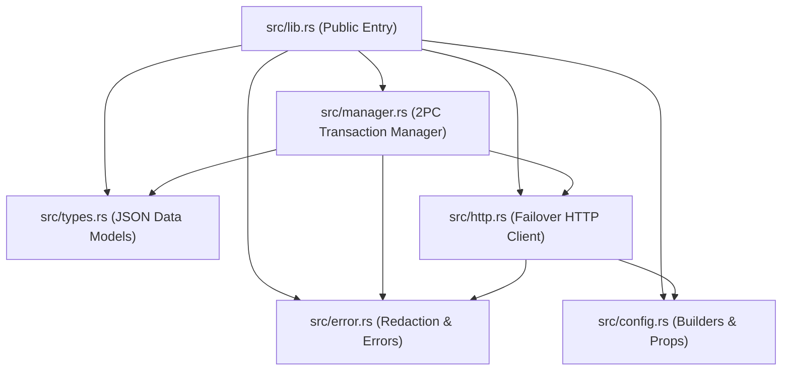
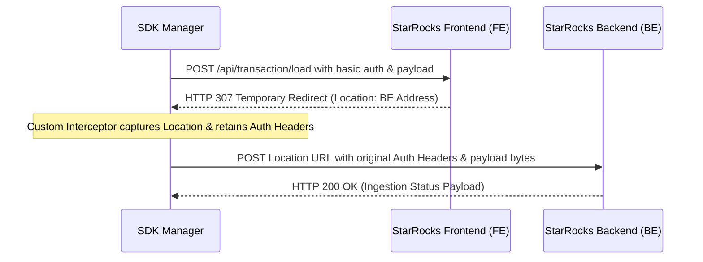
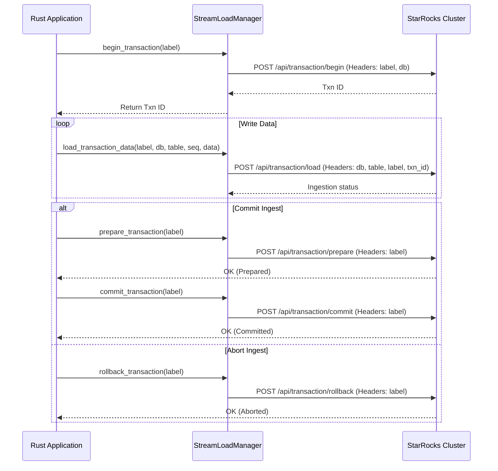

# StarRocks Stream Load Rust SDK: Developer Agent Documentation

This document provides developer agents and future engineers with context, architectural maps, internal design choices, and flow diagrams for the StarRocks Stream Load Rust SDK.

---

## Codebase Architecture & Modules

The SDK is organized cleanly into modular Rust files inside `src/`. Below is the dependency and module relation tree:

### Module Responsibilities:
- **`src/config.rs`**: Builder types representing table properties and client settings. Silent allowances for typical builder candidates are structured at the crate root.
- **`src/types.rs`**: Strictly typed deserializers for StarRocks HTTP responses. Captures transaction metadata, loaded row counts, and error log locations.
- **`src/error.rs`**: Crate error aggregation. Handles sensitive string redacting (`redact_sensitive_info`) which automatically removes user authentication details.
- **`src/http.rs`**: Core network communication layer. Controls active node polling, round-robin frontend address rotation, and custom HTTP 307 interception.
- **`src/manager.rs`**: High-level transaction orchestration. Manages Direct Load (V1 API) and 2PC Transaction Load (V2 API).

---

## Custom Redirect Handling (HTTP 307 Interception)

### The Problem
During Stream Load, the Frontend (FE) node acts as a router. When receiving data, it responds with an HTTP `307 Temporary Redirect` specifying a target Backend (BE) node.
By default, standard HTTP clients like `reqwest`:
1. Strip all authentication and payload headers on redirect to prevent information leaks.
2. Strip streamable bodies or prevent multi-part body re-transmission.

### The Solution
We disable default automatic redirects inside `reqwest` and manually handle `307` responses in `src/http.rs`:

By performing the redirect manually, we ensure that authorization headers are securely re-attached and body payloads are safely re-streamed to the target BE.

---

## Two-Phase Commit (2PC) Ingestion Pipeline Flow

The transactional loading flow enables exactly-once processing across multiple tables using a transaction label coordination scheme:

---

## Key Performance & Safety Optimizations

1. **Infallible Header Construction**: Instead of unwrapping conversion results or using panicky constructs, we utilize checked HeaderValue parsing with fallback mapping (`and_then` / functional mapping).
2. **Minimizing Heap Allocations**: In our `build_headers` utility, we insert values conditionally and reference original strings rather than cloning.
3. **Rust Lifetimes and Borrowing**: We borrow properties (`&StreamLoadTableProperties`) instead of cloning to keep memory overhead to a minimum during serialization.
4. **Log Sanitization**: Log messages are passed through `redact_sensitive_info` which uses compiled regex patterns to replace raw credentials with `[REDACTED]` prior to formatting, keeping security leaks out of error payloads.
5. **Node Routing Failover**: Round-robin frontend URL tracking maintains a sequence indicator. When a node failover triggers, the manager increments this index modulo the length of the configured endpoint addresses.
