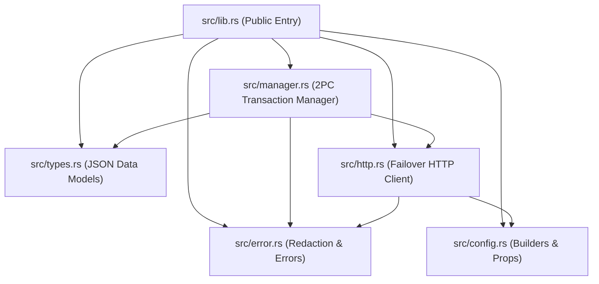
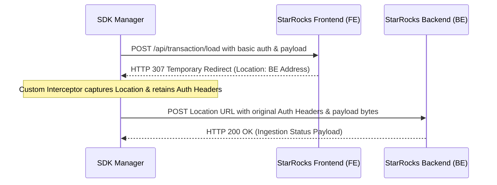
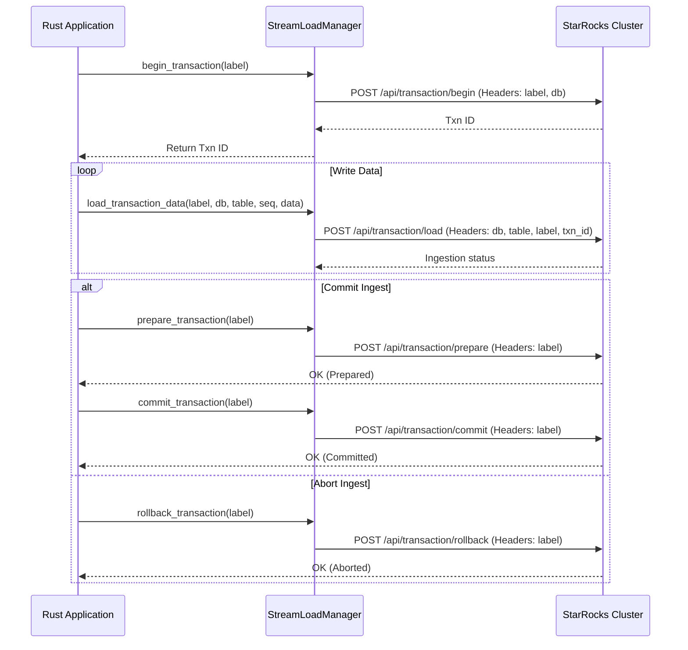

# StarRocks Stream Load Rust SDK: Developer Agent Documentation

This document provides developer agents and future engineers with context, architectural maps, internal design choices, and flow diagrams for the StarRocks Stream Load Rust SDK.

---

## Codebase Architecture & Modules

The SDK is organized cleanly into modular Rust files inside `src/`. Below is the dependency and module relation tree:


```mermaid
graph TD
    lib["src/lib.rs (Public Entry)"]
    config["src/config.rs (Builders & Props)"]
    types["src/types.rs (JSON Data Models)"]
    error["src/error.rs (Redaction & Errors)"]
    http["src/http.rs (Failover HTTP Client)"]
    manager["src/manager.rs (2PC Transaction Manager)"]

    lib --> config
    lib --> types
    lib --> error
    lib --> http
    lib --> manager

    manager --> http
    manager --> error
    manager --> types
    http --> config
    http --> error
```

### Module Responsibilities:
- **`src/config.rs`**: Builder types representing table properties and client settings. Silent allowances for typical builder candidates are structured at the crate root.
- **`src/types.rs`**: Strictly typed deserializers for StarRocks HTTP responses. Captures transaction metadata, loaded row counts, and error log locations.
- **`src/error.rs`**: Crate error aggregation. Handles sensitive string redacting (`redact_sensitive_info`), error log sanitization (`sanitize_error_log`), and abort tracking URL extraction (`try_get_error_log_url_from_txn_abort_reason`).
- **`src/http.rs`**: Core network communication layer. Controls active node polling, round-robin frontend address rotation, and custom HTTP 307 interception.
- **`src/manager.rs`**: High-level transaction orchestration. Manages Direct Load (V1 API), 2PC Transaction Load (V2 API), delimiter conversion, and transactional error log extraction.

---

## Custom Redirect Handling (HTTP 307 Interception)

### The Problem
During Stream Load, the Frontend (FE) node acts as a router. When receiving data, it responds with an HTTP `307 Temporary Redirect` specifying a target Backend (BE) node.
By default, standard HTTP clients like `reqwest`:
1. Strip all authentication and payload headers on redirect to prevent information leaks.
2. Strip streamable bodies or prevent multi-part body re-transmission.

### The Solution
We disable default automatic redirects inside `reqwest` and manually handle `307` responses in `src/http.rs`:


```mermaid
sequenceDiagram
    participant Client as SDK Manager
    participant FE as StarRocks Frontend (FE)
    participant BE as StarRocks Backend (BE)

    Client->>FE: POST /api/transaction/load with basic auth & payload
    FE-->>Client: HTTP 307 Temporary Redirect (Location: BE Address)
    Note over Client: Custom Interceptor captures Location & retains Auth Headers
    Client->>BE: POST Location URL with original Auth Headers & payload bytes
    BE-->>Client: HTTP 200 OK (Ingestion Status Payload)
```

By performing the redirect manually, we ensure that authorization headers are securely re-attached and body payloads are safely re-streamed to the target BE.

---

## Two-Phase Commit (2PC) Ingestion Pipeline Flow

The transactional loading flow enables exactly-once processing across multiple tables using a transaction label coordination scheme:


```mermaid
sequenceDiagram
    participant App as Rust Application
    participant Manager as StreamLoadManager
    participant Cluster as StarRocks Cluster

    App->>Manager: begin_transaction(label)
    Manager->>Cluster: POST /api/transaction/begin (Headers: label, db)
    Cluster-->>Manager: Txn ID
    Manager-->>App: Return Txn ID

    loop Write Data
        App->>Manager: load_transaction_data(label, db, table, seq, data)
        Manager->>Cluster: POST /api/transaction/load (Headers: db, table, label, txn_id)
        Cluster-->>Manager: Ingestion status
    end

    alt Commit Ingest
        App->>Manager: prepare_transaction(label)
        Manager->>Cluster: POST /api/transaction/prepare (Headers: label)
        Cluster-->>App: OK (Prepared)
        App->>Manager: commit_transaction(label)
        Manager->>Cluster: POST /api/transaction/commit (Headers: label)
        Cluster-->>App: OK (Committed)
    else Abort Ingest
        App->>Manager: rollback_transaction(label)
        Manager->>Cluster: POST /api/transaction/rollback (Headers: label)
        Cluster-->>App: OK (Aborted)
    end
```

---

## Key Performance & Safety Optimizations

1. **Infallible Header Construction**: Instead of unwrapping conversion results or using panicky constructs, we utilize checked HeaderValue parsing with fallback mapping (`and_then` / functional mapping).
2. **Minimizing Heap Allocations**: In our `build_headers` utility, we insert values conditionally and reference original strings rather than cloning.
3. **Rust Lifetimes and Borrowing**: We borrow properties (`&StreamLoadTableProperties`) instead of cloning to keep memory overhead to a minimum during serialization.
4. **Log Sanitization**: Log messages are passed through `redact_sensitive_info` which uses compiled regex patterns to replace raw credentials with `[REDACTED]` prior to formatting, keeping security leaks out of error payloads.
5. **Node Routing Failover**: Round-robin frontend URL tracking maintains a sequence indicator. When a node failover triggers, the manager increments this index modulo the length of the configured endpoint addresses.
6. **Optional Mutually Exclusive TLS Features**: Default is no TLS/SSL. If enabled, the user must select between `rustls` or `native-tls` features. Enabling both is prevented by compile-time error checks in `src/lib.rs`. Initializing the client with `https://` URLs without enabling either feature is validated and rejected with a clear runtime error in `src/http.rs`.

---

## Production-Ready Implementation Guide

### SDK Design Philosophy
This SDK provides **minimal, building-block functionality** for StarRocks stream loading. It intentionally delegates retry strategies, circuit breakers, metrics collection, and resilience patterns to the **application layer**. This design choice ensures:
- **Flexibility**: Applications can implement custom retry logic suited to their use cases
- **Performance**: No unnecessary overhead for simple use cases
- **Maintainability**: SDK remains focused on core StarRocks protocol handling

### Required Production Components

Application developers **must implement** the following patterns for production deployments:

#### 1. Exponential Backoff Retry Strategy
The SDK provides basic retry at the network level, but production applications should implement exponential backoff with jitter:

```rust
use tokio::time::{sleep, Duration};
use std::time::Instant;

async fn with_exponential_backoff<F, Fut, T>(mut f: F, max_attempts: usize) -> Result<T, Box<dyn std::error::Error>>
where
    F: FnMut() -> Fut,
    Fut: std::future::Future<Output = Result<T, Box<dyn std::error::Error>>>,
{
    let mut last_error = None;
    
    for attempt in 0..max_attempts {
        let start = Instant::now();
        
        match f().await {
            success @ Ok(_) => return success,
            Err(error) => {
                last_error = Some(error);
                
                if attempt < max_attempts - 1 {
                    // Exponential backoff with jitter to prevent thundering herd
                    let base_delay_ms = 100 * 2u64.pow(attempt as u32);
                    let jitter_ms = (base_delay_ms as f64 * 0.1) as u64;
                    let delay = Duration::from_millis(base_delay_ms.min(30000) + jitter_ms);
                    
                    tracing::warn!(
                        "Attempt {} failed in {}ms, retrying in {}ms",
                        attempt + 1,
                        start.elapsed().as_millis(),
                        delay.as_millis()
                    );
                    
                    sleep(delay).await;
                }
            }
        }
    }
    
    Err(last_error.unwrap())
}

// Usage example:
let result = with_exponential_backoff(|| async {
    manager.send_single_batch("label_2026_07_07", data.clone()).await
        .map_err(|e| e.into())
}, 5).await?;
```

#### 2. Circuit Breaker Pattern
Prevent cascading failures by implementing circuit breakers around critical operations:

```rust
use std::sync::atomic::{AtomicU64, AtomicU8, Ordering};
use std::sync::Arc;
use std::time::{Duration, Instant};

#[derive(Debug)]
struct CircuitBreaker {
    failure_count: AtomicU64,
    last_failure_time: AtomicU64,
    threshold: u64,
    recovery_timeout: Duration,
    state: AtomicU8, // 0 = closed, 1 = open, 2 = half-open
}

impl CircuitBreaker {
    fn new(threshold: u64, recovery_timeout: Duration) -> Self {
        Self {
            failure_count: AtomicU64::new(0),
            last_failure_time: AtomicU64::new(0),
            threshold,
            recovery_timeout,
            state: AtomicU8::new(0),
        }
    }

    fn can_proceed(&self) -> bool {
        let current_state = self.state.load(Ordering::Acquire);
        
        match current_state {
            0 => true, // closed
            1 => { // open
                let last_failure = self.last_failure_time.load(Ordering::Acquire);
                let elapsed = Instant::now() - Duration::from_secs(last_failure);
                if elapsed > self.recovery_timeout {
                    self.state.store(2, Ordering::Release); // Move to half-open
                    true
                } else {
                    false
                }
            }
            _ => true, // half-open
        }
    }

    fn record_success(&self) {
        self.failure_count.store(0, Ordering::Release);
        self.state.store(0, Ordering::Release);
    }

    fn record_failure(&self) {
        let failures = self.failure_count.fetch_add(1, Ordering::Release) + 1;
        self.last_failure_time.store(
            Instant::now().elapsed().as_secs(),
            Ordering::Release
        );
        
        if failures >= self.threshold {
            self.state.store(1, Ordering::Release); // Open circuit
            tracing::error!("Circuit breaker opened after {} failures", failures);
        }
    }
}

// Usage example:
let circuit_breaker = Arc::new(CircuitBreaker::new(5, Duration::from_secs(60)));
let manager_clone = Arc::new(manager.clone());

async fn safe_stream_load(circuit_breaker: Arc<CircuitBreaker>, manager: Arc<StreamLoadManager>) -> Result<StreamLoadResponse, Error> {
    if !circuit_breaker.can_proceed() {
        return Err(Error::Transaction("Circuit breaker is open".to_string()));
    }
    
    manager.send_single_batch("label_2026_07_07", data.clone()).await
        .map(|response| {
            circuit_breaker.record_success();
            response
        })
        .map_err(|error| {
            circuit_breaker.record_failure();
            error
        })
}
```

#### 3. Metrics Collection
Implement comprehensive metrics for production monitoring:

```rust
use std::sync::atomic::{AtomicU64, AtomicUsize, Ordering};
use std::time::Instant;

#[derive(Debug, Default)]
pub struct Metrics {
    pub total_requests: AtomicUsize,
    pub successful_requests: AtomicUsize,
    pub failed_requests: AtomicUsize,
    pub total_retries: AtomicUsize,
    pub total_duration_ms: AtomicU64,
}

impl Metrics {
    pub fn record_request(&self) {
        self.total_requests.fetch_add(1, Ordering::Relaxed);
    }

    pub fn record_success(&self, duration_ms: u64) {
        self.successful_requests.fetch_add(1, Ordering::Relaxed);
        self.total_duration_ms.fetch_add(duration_ms, Ordering::Relaxed);
    }

    pub fn record_failure(&self) {
        self.failed_requests.fetch_add(1, Ordering::Relaxed);
    }

    pub fn record_retry(&self) {
        self.total_retries.fetch_add(1, Ordering::Relaxed);
    }

    pub fn get_success_rate(&self) -> f64 {
        let total = self.total_requests.load(Ordering::Relaxed);
        if total == 0 {
            return 0.0;
        }
        let success = self.successful_requests.load(Ordering::Relaxed);
        (success as f64 / total as f64) * 100.0
    }

    pub fn get_average_duration_ms(&self) -> f64 {
        let successful = self.successful_requests.load(Ordering::Relaxed);
        if successful == 0 {
            return 0.0;
        }
        let total_duration = self.total_duration_ms.load(Ordering::Relaxed);
        total_duration as f64 / successful as f64
    }
}

// Usage example:
let metrics = Arc::new(Metrics::default());
let start = Instant::now();

match manager.send_single_batch("label_2026_07_07", data.clone()).await {
    Ok(response) => {
        let duration = start.elapsed().as_millis() as u64;
        metrics.record_success(duration);
        Ok(response)
    }
    Err(error) => {
        metrics.record_failure();
        Err(error)
    }
}
```

#### 4. Transaction State Management
For 2PC transactions, implement proper state tracking and recovery:

```rust
use std::collections::HashMap;
use std::sync::{Arc, Mutex};

#[derive(Debug, Clone, PartialEq)]
enum TransactionState {
    NotStarted,
    Begun(i64),
    Loaded,
    Prepared,
    Committed,
    RolledBack,
    Failed(String),
}

#[derive(Debug)]
pub struct TransactionManager {
    active_transactions: Arc<Mutex<HashMap<String, TransactionState>>>,
}

impl TransactionManager {
    pub fn new() -> Self {
        Self {
            active_transactions: Arc::new(Mutex::new(HashMap::new())),
        }
    }

    pub async fn begin_transaction(&self, label: String, manager: Arc<StreamLoadManager>) -> Result<i64, Error> {
        let txn_id = manager.begin_transaction(&label).await?;
        
        // Track transaction state
        let mut transactions = self.active_transactions.lock().unwrap();
        transactions.insert(label.clone(), TransactionState::Begun(txn_id));
        
        tracing::info!("Transaction '{}' begun with ID: {}", label, txn_id);
        Ok(txn_id)
    }

    pub async fn commit_transaction(&self, label: String, manager: Arc<StreamLoadManager>) -> Result<StreamLoadResponse, Error> {
        // Ensure transaction is in valid state for commit
        let current_state = {
            let transactions = self.active_transactions.lock().unwrap();
            transactions.get(&label).cloned()
        };
        
        match current_state {
            Some(TransactionState::Prepared) => {
                // Proceed with commit
                manager.commit_transaction(&label).await.map(|response| {
                    let mut transactions = self.active_transactions.lock().unwrap();
                    transactions.insert(label, TransactionState::Committed);
                    response
                })
            }
            Some(TransactionState::Begun(_)) | Some(TransactionState::Loaded) => {
                // Auto-prepare before commit
                manager.prepare_transaction(&label).await?;
                manager.commit_transaction(&label).await.map(|response| {
                    let mut transactions = self.active_transactions.lock().unwrap();
                    transactions.insert(label, TransactionState::Committed);
                    response
                })
            }
            Some(state) => {
                Err(Error::Transaction(
                    format!("Cannot commit transaction in state: {:?}", state)
                ))
            }
            None => {
                Err(Error::Transaction("Transaction not found".to_string()))
            }
        }
    }

    pub async fn rollback_transaction(&self, label: String, manager: Arc<StreamLoadManager>) -> Result<StreamLoadResponse, Error> {
        manager.rollback_transaction(&label).await.map(|response| {
            let mut transactions = self.active_transactions.lock().unwrap();
            transactions.insert(label, TransactionState::RolledBack);
            response
        })
    }
}
```

### Complete Production Example
Here's how to combine all components for robust production usage:

```rust
use starrocks_stream_load::{DataFormat, StreamLoadConfig, StreamLoadManager, StreamLoadTableProperties};
use bytes::Bytes;
use std::sync::Arc;

#[tokio::main]
async fn main() -> Result<(), Box<dyn std::error::Error>> {
    // Initialize configuration
    let config = StreamLoadConfig::builder(
        vec!["http://127.0.0.1:8030".to_string()],
        "my_database".to_string(),
        "admin".to_string(),
    )
    .password("your_password")
    .max_retries(2) // SDK-level retries
    .build();

    let properties = StreamLoadTableProperties::builder()
        .table("my_table")
        .format(DataFormat::CSV)
        .column_separator(",")
        .build();

    // Initialize production components
    let manager = Arc::new(StreamLoadManager::new(config, properties)?);
    let circuit_breaker = Arc::new(CircuitBreaker::new(5, Duration::from_secs(60)));
    let metrics = Arc::new(Metrics::default());
    let txn_manager = Arc::new(TransactionManager::new());

    // Perform operations with production-grade resilience
    let payload = Bytes::from("1,John,Doe\n2,Jane,Smith\n");
    let label = format!("txn_{}", chrono::Utc::now().timestamp());
    
    let result = with_exponential_backoff(
        || async {
            if !circuit_breaker.can_proceed() {
                return Err(Box::new(Error::Transaction("Circuit breaker open".to_string())) as Box<dyn std::error::Error>);
            }
            
            let start = Instant::now();
            match manager.send_single_batch(&label, payload.clone()).await {
                Ok(response) => {
                    let duration = start.elapsed().as_millis() as u64;
                    metrics.record_success(duration);
                    circuit_breaker.record_success();
                    Ok(response)
                }
                Err(error) => {
                    metrics.record_failure();
                    circuit_breaker.record_failure();
                    Err(Box::new(error) as Box<dyn std::error::Error>)
                }
            }
        },
        5 // Max retries
    ).await?;
    
    tracing::info!("Load completed: {:?}", result);
    tracing::info!("Metrics - Success Rate: {}%, Avg Duration: {}ms", 
                   metrics.get_success_rate(), 
                   metrics.get_average_duration_ms());
    
    Ok(())
}
```

### Production Deployment Checklist

Before deploying to production, ensure:

- [ ] **Retry Strategy**: Implement exponential backoff with jitter
- [ ] **Circuit Breaker**: Add circuit breakers to prevent cascading failures  
- [ ] **Metrics Collection**: Implement comprehensive metrics and monitoring
- [ ] **Transaction State Management**: Proper transaction state tracking and recovery
- [ ] **Error Handling**: Comprehensive error logging and recovery procedures
- [ ] **Logging**: Structured logging with sensitive data redaction
- [ ] **Configuration**: Configurable timeouts and retry limits
- [ ] **Testing**: Load testing and failure scenario testing
- [ ] **Documentation**: Clear operational procedures for failure handling

### Testing and Validation

Always test failure scenarios:

```rust
#[tokio::test]
async fn test_circuit_breaker_protection() {
    let manager = create_test_manager();
    let circuit_breaker = Arc::new(CircuitBreaker::new(3, Duration::from_secs(2)));
    
    // Trigger failures to open circuit
    for _ in 0..5 {
        let cb = circuit_breaker.clone();
        let mgr = manager.clone();
        tokio::spawn(async move {
            safe_stream_load(cb, mgr).await;
        });
    }
    
    // Wait for circuit to be open
    tokio::time::sleep(Duration::from_secs(1)).await;
    
    // Verify circuit is open
    assert!(!circuit_breaker.can_proceed());
    
    // Wait for recovery timeout
    tokio::time::sleep(Duration::from_secs(3)).await;
    
    // Circuit should allow request now
    assert!(circuit_breaker.can_proceed());
}
```
